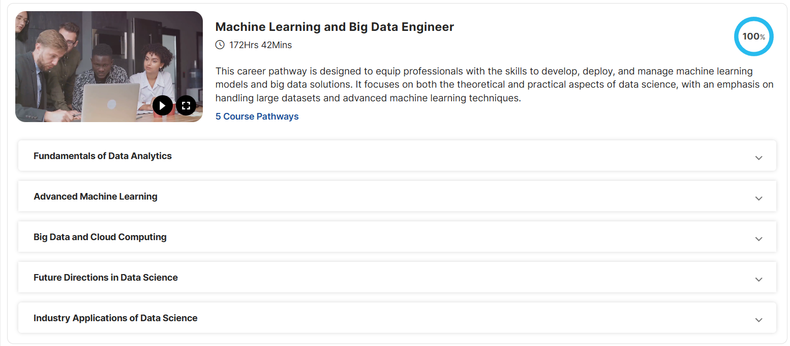

<!-- ============================================================
     L&T EduTech — Machine Learning & Big Data Engineer
     README.md  |  Last Updated: March 2026
     ============================================================ -->

<div align="center">


# 🎓 L&T EduTech — Learning Repository

### *Machine Learning and Big Data Engineer*

[](https://ssipmtlearnkonnect.lntedutech.com/Home)
[](https://ssipmtlearnkonnect.lntedutech.com/pathwaysLearning)
[](#)
[](#)
[](#)

---

> **"This career pathway is designed to equip professionals with the skills to develop, deploy, and manage machine learning models and big data solutions. It focuses on both the theoretical and practical aspects of data science, with an emphasis on handling large datasets and advanced machine learning techniques."**
>
> — *L&T EduTech, SSIPMT LearnKonnect Platform*

</div>

---

## 📌 Table of Contents

- [About This Repository](#-about-this-repository)
- [Platform & Pathway](#-platform--pathway)
- [Career Pathway Overview](#-career-pathway-overview)
- [📁 Repository Structure](#-repository-structure)
- [Course 1 — Fundamentals of Data Analytics](#-course-1--fundamentals-of-data-analytics)
  - [Introduction to Data Analysis](#-introduction-to-data-analysis)
  - [SQL for Data Analysis](#-sql-for-data-analysis)
  - [Advanced Excel Techniques](#-advanced-excel-techniques)
- [Course 2 — Advanced Machine Learning](#-course-2--advanced-machine-learning)
- [Course 3 — Big Data and Cloud Computing](#-course-3--big-data-and-cloud-computing)
- [Course 4 — Future Directions in Data Science](#-course-4--future-directions-in-data-science)
- [Course 5 — Industry Applications of Data Science](#-course-5--industry-applications-of-data-science)
- [Tech Stack & Tools](#-tech-stack--tools)
- [Progress Tracker](#-progress-tracker)
- [How to Run the Notebooks](#-how-to-run-the-notebooks)

---

## 📖 About This Repository

This repository is a **personal learning log** of my journey through the **Machine Learning and Big Data Engineer** career pathway on the **L&T EduTech (SSIPMT LearnKonnect)** platform. It documents all hands-on notebooks, datasets, notes, screenshots, and practice files I worked through during the course.

The repository serves as:
- 📚 A **personal reference guide** for concepts learned
- 🗂️ An **organized archive** of all course materials and code
- 💼 A **portfolio showcase** of practical data science work (Pandas, SQL, Excel, ML)
- 🔁 A **revision resource** for future interview and project preparation

---

## 🌐 Platform & Pathway

| Field | Details |
|-------|---------|
| **Platform** | [L&T EduTech — SSIPMT LearnKonnect](https://ssipmtlearnkonnect.lntedutech.com/Home) |
| **Pathway Page** | [My Learning Pathway](https://ssipmtlearnkonnect.lntedutech.com/pathwaysLearning) |
| **Pathway Title** | Machine Learning and Big Data Engineer |
| **Total Duration** | 172 Hours 42 Minutes |
| **Course Pathways** | 5 |
| **Completion** | ✅ 100% Complete |
| **Offered By** | L&T EduTech × VIT (SSIPMT) |

---

## 🗺️ Career Pathway Overview

The **Machine Learning and Big Data Engineer** pathway is a structured, industry-aligned career program offered by **L&T EduTech** in collaboration with institutions under **SSIPMT LearnKonnect**. It spans across **5 comprehensive course pathways** covering the full data science and ML lifecycle:

<div align="center">

<br/>
<em>🎓 Career Pathway Overview — 100% Completed on L&T EduTech Platform</em>
</div>

<br/>

```
┌─────────────────────────────────────────────────────────────────────────────┐
│         MACHINE LEARNING AND BIG DATA ENGINEER  [ ✅ 100% COMPLETE ]        │
│                          172 Hrs 42 Mins  |  5 Pathways                     │
├────────────────┬──────────────────────────┬───────────────────────────────  │
│  📊 Course 1   │  Fundamentals of         │  Data Analytics · Pandas        │
│                │  Data Analytics          │  SQL · Excel                    │
├────────────────┼──────────────────────────┼─────────────────────────────────│
│  🤖 Course 2   │  Advanced Machine        │  Supervised / Unsupervised      │
│                │  Learning                │  Learning · Deep Learning       │
├────────────────┼──────────────────────────┼─────────────────────────────────│
│  ☁️  Course 3   │  Big Data and Cloud      │  Hadoop · Spark · AWS/GCP       │
│                │  Computing               │  Cloud Architecture             │
├────────────────┼──────────────────────────┼─────────────────────────────────│
│  🔭 Course 4   │  Future Directions in    │  AutoML · Federated Learning    │
│                │  Data Science            │  Explainability · AI Ethics     │
├────────────────┼──────────────────────────┼─────────────────────────────────│
│  🏭 Course 5   │  Industry Applications   │  Healthcare · Finance           │
│                │  of Data Science         │  Manufacturing · Retail         │
└─────────────────────────────────────────────────────────────────────────────┘
```

---

## 📁 Repository Structure

```
L&T EduTech/
│
├── 📂 Machine Learning and Big Data Engineer/
│   │
│   └── 📂 Fundamentals of Data Analytics/
│       │
│       ├── 📂 Introduction to Data Analysis/
│       │   └── 📂 pandas/
│       │       ├── 📓 01 - Installation and Setup.ipynb
│       │       ├── 📓 02 - Python Crash Course.ipynb
│       │       ├── 📓 03 - Series.ipynb
│       │       ├── 📓 04 DataFrame - Introduction.ipynb
│       │       ├── 📓 Playground.ipynb
│       │       ├── 📊 google_stock_price.csv
│       │       ├── 📊 nba.csv
│       │       ├── 📊 pokemon.csv
│       │       └── 📊 revenue.csv
│       │
│       ├── 📂 SQL for Data Analysis/
│       │   └── 📂 Databases - Terminology/
│       │       └── 🖼️ image.png  (+ 17 more reference screenshots)
│       │
│       └── 📂 Advanced Excel Techniques/
│           └── 📂 Excel 2019 Advanced Functions/
│               ├── 📊 Depreciation_Practice.xlsx
│               └── 📊 Practice data_1.xlsx
│
└── 📄 README.md
```

---

## 📊 Course 1 — Fundamentals of Data Analytics

> **Goal:** Build a solid foundation in data analysis tools — Python (Pandas), SQL, Power BI, and Excel — to clean, query, visualize, and explore datasets effectively.

#### 🎬 Video Curriculum — 7 Courses | ~37 Hrs 29 Mins

| # | Video Course | Duration | Status |
|:-:|-------------|:--------:|:------:|
| 1 | 📘 Introduction to Data Analysis | `08:54:00` | ✅ 100% |
| 2 | 📘 SQL for Data Analysis | `03:55:00` | ✅ 100% |
| 3 | 📘 Introduction to Power BI | `09:38:00` | ✅ 100% |
| 4 | 📘 Advanced Excel Techniques | `04:46:00` | ✅ 100% |
| 5 | 📘 Excel for Data Analysis | `04:16:01` | ✅ 100% |
| 6 | 📘 Data Cleaning and Transformation | `05:00:00` | ✅ 100% |
| 7 | 📝 Course Pathway Evaluation | `01:00:00` | ✅ 100% |

---

### 🐍 Introduction to Data Analysis

**Path:** `Machine Learning and Big Data Engineer/Fundamentals of Data Analytics/Introduction to Data Analysis/pandas/`

This module covers **Python for Data Analysis** using the powerful **Pandas** library. All work is organized as Jupyter Notebooks with real-world datasets.

#### 📓 Notebooks

| # | Notebook | Description | Size |
|---|----------|-------------|------|
| 01 | `01 - Installation and Setup.ipynb` | Setting up Python, Jupyter, and Pandas environment | ~1 KB |
| 02 | `02 - Python Crash Course.ipynb` | Quick Python refresher: lists, dicts, loops, functions | ~48 KB |
| 03 | `03 - Series.ipynb` | Pandas Series: creation, indexing, operations, methods | ~121 KB |
| 04 | `04 DataFrame - Introduction.ipynb` | Pandas DataFrames: loading, slicing, filtering, groupby | ~305 KB |
| 05 | `Playground.ipynb` | Personal scratch notebook for experiments | ~1.4 KB |

#### 📊 Datasets Used

| Dataset | Description | Size |
|---------|-------------|------|
| `google_stock_price.csv` | Historical Google stock price data | ~473 KB |
| `nba.csv` | NBA player statistics dataset | ~32 KB |
| `pokemon.csv` | Pokémon attributes and stats | ~43 KB |
| `revenue.csv` | Sample business revenue data | ~269 B |

#### 🧠 Key Concepts Covered

- ✅ Python fundamentals (data types, control flow, functions)
- ✅ Pandas `Series` — creation, label/positional indexing, arithmetic
- ✅ Pandas `DataFrame` — reading CSVs, `.head()`, `.info()`, `.describe()`
- ✅ Filtering, sorting, and grouping data
- ✅ Working with real-world messy datasets

---

### 🗄️ SQL for Data Analysis

**Path:** `Machine Learning and Big Data Engineer/Fundamentals of Data Analytics/SQL for Data Analysis/Databases - Terminology/`

This module covers **SQL fundamentals** with a focus on database terminology, query construction, and data retrieval. The study materials are captured as reference screenshots from the platform.

#### 🖼️ Reference Materials

| Count | Type | Content |
|-------|------|---------|
| 18 | `.png` screenshots | Platform lesson slides on DB concepts |

#### 🧠 Key Concepts Covered

- ✅ What is a Database? RDBMS vs NoSQL
- ✅ Tables, Rows, Columns, Primary & Foreign Keys
- ✅ SQL Data Types and Constraints
- ✅ `SELECT`, `WHERE`, `ORDER BY`, `GROUP BY`
- ✅ `JOIN` operations (INNER, LEFT, RIGHT, FULL)
- ✅ Aggregate functions: `COUNT`, `SUM`, `AVG`, `MIN`, `MAX`
- ✅ Subqueries and Nested queries
- ✅ Database design fundamentals

---

### 📊 Advanced Excel Techniques

**Path:** `Machine Learning and Big Data Engineer/Fundamentals of Data Analytics/Advanced Excel Techniques/Excel 2019 Advanced Functions/`

This module covers **Excel 2019 Advanced Functions** with hands-on practice files used during the lessons.

#### 📁 Practice Files

| File | Description |
|------|-------------|
| `Depreciation_Practice.xlsx` | Practice workbook for depreciation calculations using functions like `SLN`, `DDB`, `VDB` |
| `Practice data_1.xlsx` | General data manipulation practice dataset |

#### 🧠 Key Concepts Covered

- ✅ Lookup functions: `VLOOKUP`, `HLOOKUP`, `INDEX-MATCH`
- ✅ Logical functions: `IF`, `AND`, `OR`, `IFS`
- ✅ Financial functions: `SLN`, `DDB`, Depreciation calculations
- ✅ Text functions: `LEFT`, `RIGHT`, `MID`, `CONCATENATE`
- ✅ Array formulas and dynamic ranges
- ✅ PivotTables and PivotCharts
- ✅ Data Validation and Conditional Formatting

---

## 🤖 Course 2 — Advanced Machine Learning

**Status:** ✅ 100% Complete on Platform | [View Pathway →](https://ssipmtlearnkonnect.lntedutech.com/pathwaysLearning)

This course pathway dives deep into cutting-edge machine learning — from advanced Excel analytics to deep learning with CNNs, NLP, and feature engineering.

#### 🎬 Video Curriculum — 6 Courses | ~36 Hrs 27 Mins

| # | Video Course | Duration | Status |
|:-:|-------------|:--------:|:------:|
| 1 | 📘 Advanced Excel Techniques | `04:46:00` | ✅ 100% |
| 2 | 📘 Deep Learning with Python: Mastering Convolutional Neural Networks (CNN) | `08:37:40` | ✅ 100% |
| 3 | 📘 Natural Language Processing | `05:11:05` | ✅ 100% |
| 4 | 📘 Advanced Python for Data Science | `07:27:53` | ✅ 100% |
| 5 | 📘 Feature Engineering and Selection | `09:25:01` | ✅ 100% |
| 6 | 📝 Course Pathway Evaluation: Advanced Machine Learning | `01:00:00` | ✅ 100% |

#### 🧠 Key Topics Covered

- ✅ Deep Learning: CNN architectures, convolutions, pooling, backpropagation
- ✅ NLP: Tokenization, word embeddings, text classification, sentiment analysis
- ✅ Advanced Python: OOP, generators, decorators, data pipelines
- ✅ Feature Engineering: feature extraction, encoding, scaling, selection techniques
- ✅ Advanced Excel: pivot analysis, complex formulas, data modeling

---

## ☁️ Course 3 — Big Data and Cloud Computing

**Status:** ✅ 100% Complete on Platform | [View Pathway →](https://ssipmtlearnkonnect.lntedutech.com/pathwaysLearning)

This course covers the full distributed computing stack — from Hadoop and Spark to AWS cloud deployment, real-time pipelines with Kafka, and ML model serving.

#### 🎬 Video Curriculum — 8 Courses | ~44 Hrs 25 Mins

| # | Video Course | Duration | Status |
|:-:|-------------|:--------:|:------:|
| 1 | 📘 Introduction to Big Data - Cloud | `05:04:07` | ✅ 100% |
| 2 | 📘 Hadoop and Spark Basics | `08:04:25` | ✅ 100% |
| 3 | 📘 Data Pipelines with Apache Kafka | `04:47:10` | ✅ 100% |
| 4 | 📘 Cloud Computing with AWS | `06:09:38` | ✅ 100% |
| 5 | 📘 Data Storage Solutions | `07:53:00` | ✅ 100% |
| 6 | 📘 Deploying Machine Learning Models on Cloud | `06:55:00` | ✅ 100% |
| 7 | 📘 Real-time Data Processing | `04:32:00` | ✅ 100% |
| 8 | 📝 Course Pathway Evaluation: Big Data and Cloud Computing | `01:00:00` | ✅ 100% |

#### 🧠 Key Topics Covered

- ✅ Big Data fundamentals: Volume, Velocity, Variety (The 3 V's)
- ✅ Hadoop Ecosystem: HDFS, MapReduce, YARN
- ✅ Apache Spark: RDDs, DataFrames, Spark SQL, MLlib
- ✅ Apache Kafka: streaming data pipelines, producers, consumers
- ✅ AWS Cloud: EC2, S3, SageMaker, Lambda
- ✅ Data Storage: SQL/NoSQL, data lakes, data warehouses
- ✅ ML Deployment: model serving, REST APIs, containerization
- ✅ Real-time processing: stream analytics, event-driven architectures

---

## 🔭 Course 4 — Future Directions in Data Science

**Status:** ✅ 100% Complete on Platform | [View Pathway →](https://ssipmtlearnkonnect.lntedutech.com/pathwaysLearning)

An advanced course exploring the frontiers of data science — time series forecasting, computer vision, reinforcement learning, graph databases, and no-code ML.

#### 🎬 Video Curriculum — 7 Courses | ~27 Hrs 02 Mins

| # | Video Course | Duration | Status |
|:-:|-------------|:--------:|:------:|
| 1 | 📘 Time Series Analysis and Forecasting | `06:09:00` | ✅ 100% |
| 2 | 📘 Reinforcement Learning Basics | `04:43:00` | ✅ 100% |
| 3 | 📘 Computer Vision with Deep Learning | `07:13:00` | ✅ 100% |
| 4 | 📘 Graph Data Engineering with Neo4j | `02:10:00` | ✅ 100% |
| 5 | 📘 Machine Learning Projects | `04:21:04` | ✅ 100% |
| 6 | 📘 Machine Learning Without Code | `01:26:12` | ✅ 100% |
| 7 | 📝 Course Pathway Evaluation: Future Directions in Data Science | `01:00:00` | ✅ 100% |

#### 🧠 Key Topics Covered

- ✅ Time Series: ARIMA, SARIMA, Prophet, trend/seasonality decomposition
- ✅ Reinforcement Learning: agents, environments, Q-learning, policy gradients
- ✅ Computer Vision: image classification, object detection, CNNs, transfer learning
- ✅ Graph Databases: Neo4j, Cypher queries, knowledge graphs
- ✅ ML Projects: end-to-end pipelines, model deployment, real-world case studies
- ✅ No-Code ML: AutoML tools, drag-and-drop model building
- ✅ Data Science Ethics: bias detection, fairness, responsible AI

---

## 🏭 Course 5 — Industry Applications of Data Science

**Status:** ✅ 100% Complete on Platform | [View Pathway →](https://ssipmtlearnkonnect.lntedutech.com/pathwaysLearning)

The capstone course bridging theory and industry — covering finance, marketing, manufacturing, search analytics, R programming, and practical end-to-end data science.

#### 🎬 Video Curriculum — 9 Courses | ~37 Hrs 23 Mins

| # | Video Course | Duration | Status |
|:-:|-------------|:--------:|:------:|
| 1 | 📘 AI in Financial Analytics | `07:05:00` | ✅ 100% |
| 2 | 📘 Digital/Web Marketing Analytics | `00:52:00` | ✅ 100% |
| 3 | 📘 Search Engine Analytics | `03:12:00` | ✅ 100% |
| 4 | 📘 Practical Data Science | `03:48:21` | ✅ 100% |
| 5 | 📘 Essentials of Manufacturing and Engineering | `01:47:00` | ✅ 100% |
| 6 | 📘 Data Science for Real World Solutions | `03:55:00` | ✅ 100% |
| 7 | 📘 Data Science Survey | `05:58:00` | ✅ 100% |
| 8 | 📘 Data Analysis with R | `09:46:35` | ✅ 100% |
| 9 | 📝 Course Pathway Evaluation: Industry Applications of Data Science | `01:00:00` | ✅ 100% |

#### 🧠 Key Topics Covered

- ✅ Financial Analytics: algorithmic trading, risk modeling, fraud detection with AI
- ✅ Digital Marketing: web analytics, campaign optimization, customer segmentation
- ✅ Search Engine Analytics: SEO data, ranking factors, search trend analysis
- ✅ Manufacturing: predictive maintenance, quality control, supply chain optimization
- ✅ R Programming: data wrangling, ggplot2, statistical modeling in R
- ✅ Real-World Solutions: end-to-end case studies across industries
- ✅ Data Science Survey: landscape overview, career paths, tool ecosystems

---

## 🛠️ Tech Stack & Tools

<div align="center">

| Category | Tools |
|----------|-------|
| **Language** | Python 3.x, SQL |
| **Data Analysis** | Pandas, NumPy |
| **Visualization** | Matplotlib, Seaborn |
| **Machine Learning** | Scikit-learn, XGBoost |
| **Deep Learning** | TensorFlow / Keras |
| **Big Data** | Apache Spark, Hadoop |
| **Notebooks** | Jupyter Notebook / JupyterLab |
| **Database** | SQLite / MySQL |
| **Spreadsheets** | Microsoft Excel 2019 |
| **Cloud** | AWS, Google Cloud Platform |
| **Version Control** | Git & GitHub |
| **Platform** | L&T EduTech (SSIPMT LearnKonnect) |

</div>

---

## 📈 Progress Tracker

| # | Course Pathway | Status | Progress |
|---|----------------|--------|----------|
| 1 | Fundamentals of Data Analytics | ✅ Complete | `█████████████████████` 100% |
| 2 | Advanced Machine Learning | ✅ Complete | `█████████████████████` 100% |
| 3 | Big Data and Cloud Computing | ✅ Complete | `█████████████████████` 100% |
| 4 | Future Directions in Data Science | ✅ Complete | `█████████████████████` 100% |
| 5 | Industry Applications of Data Science | ✅ Complete | `█████████████████████` 100% |
| — | **Overall Pathway** | **✅ 100% Done** | `█████████████████████` **100%** |

---

## 🚀 How to Run the Notebooks

Follow these steps to run the Jupyter notebooks locally:

### 1. Prerequisites

Make sure you have Python and the required libraries installed:

```bash
# Install Jupyter and core data science libraries
pip install jupyter pandas numpy matplotlib seaborn scikit-learn
```

### 2. Clone / Open the Repository

```bash
# Navigate to the pandas notebooks folder
cd "Machine Learning and Big Data Engineer/Fundamentals of Data Analytics/Introduction to Data Analysis/pandas"
```

### 3. Launch Jupyter

```bash
jupyter notebook
```

This will open Jupyter in your browser. Select any `.ipynb` file to open and run it.

### 4. Run Notebooks in Order

Start from `01 - Installation and Setup.ipynb` and proceed sequentially for the best learning experience.

---

## 📝 Notes on Repository Organization

- 📸 **SQL Screenshots** — The `Databases - Terminology` folder contains 18 captured screenshots from the L&T platform lessons, serving as visual reference notes.
- 📊 **Datasets** — All CSV datasets in the `pandas/` folder are real-world data used directly in the notebooks.
- 📁 **Excel Files** — Practice files under `Advanced Excel Techniques` contain structured exercises aligned with platform lessons.
- 🗂️ **Future Courses** — Folders for Courses 2–5 will be added as local materials are organized.

---

<div align="center">

---

### 🎯 Learning Goal

> *"Become proficient in the complete data science lifecycle — from raw data to deployed ML models — with hands-on expertise in Python, SQL, Big Data tools, and cloud platforms."*

---

**Made with ❤️ as part of the L&T EduTech × SSIPMT learning journey**

[](https://ssipmtlearnkonnect.lntedutech.com/Home)
[](https://ssipmtlearnkonnect.lntedutech.com/pathwaysLearning)

*Last Updated: March 2026*

</div>
